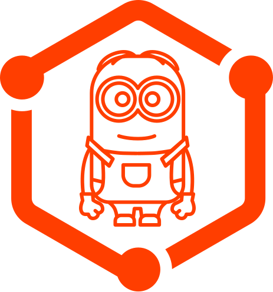

# SvelteKit - My Minion

_A coding assistant helping you building a Full Stack SvelteKit Application._

## How to

Simply start with:

> yarn add -D sveltekit-my-minion

And follow this opinionated guide.

## Tools involved

- ✅ [SvelteKit](https://kit.svelte.dev/)
- ✅ [GraphQL](https://graphql.org/)
- ✅ [GraphQL - Yoga](https://www.graphql-yoga.com/)
- ✅ [GraphQL - CodeGen](https://www.graphql-code-generator.com/)

## License

